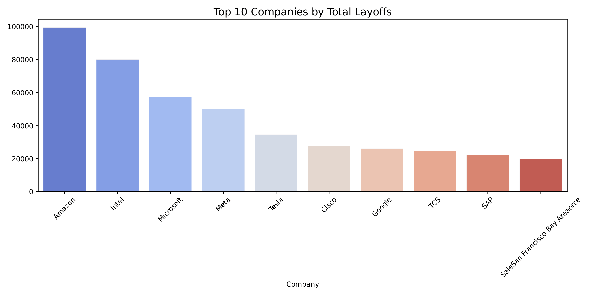
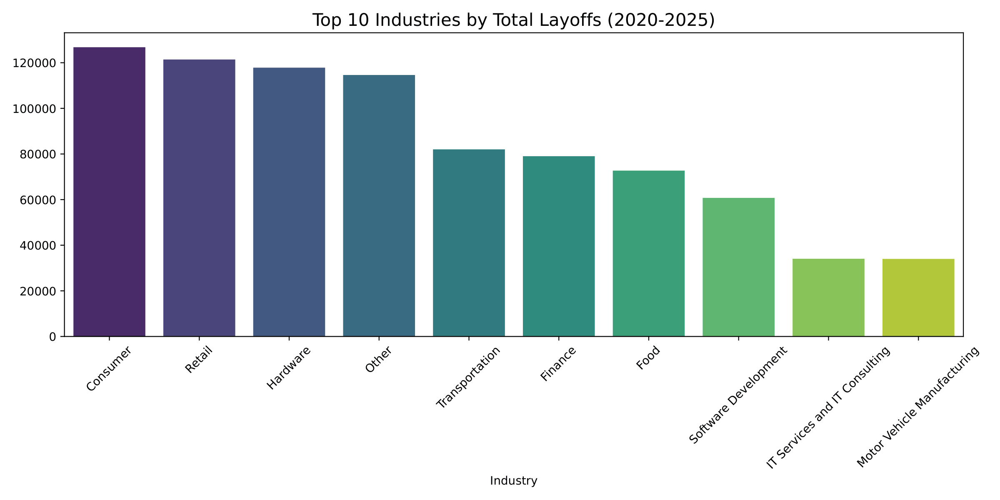
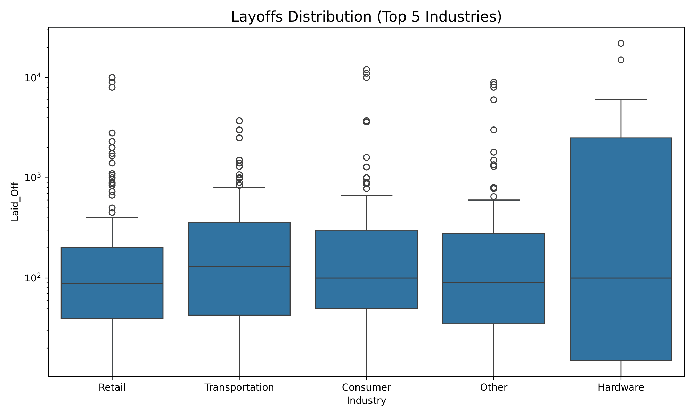
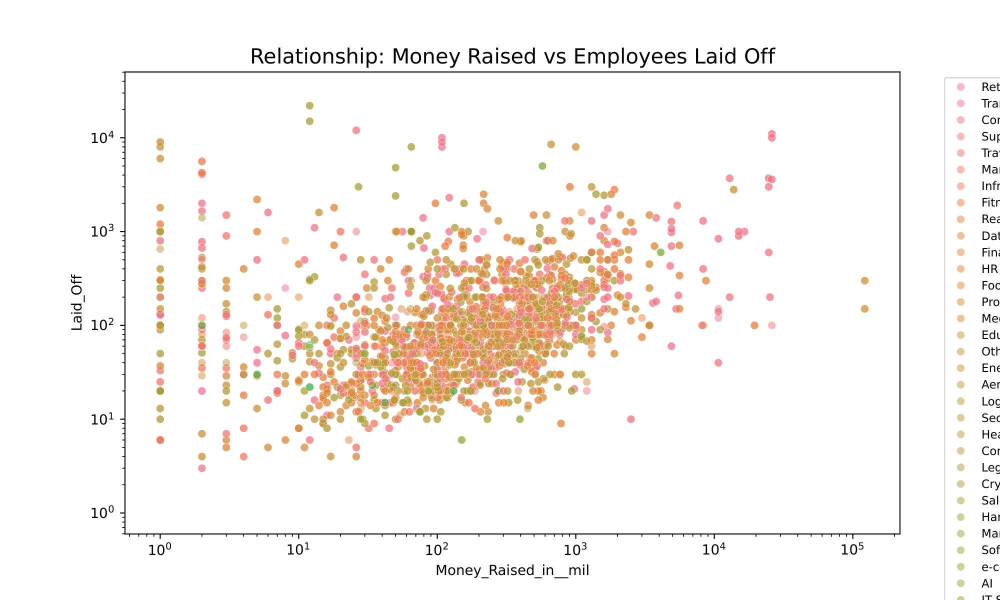
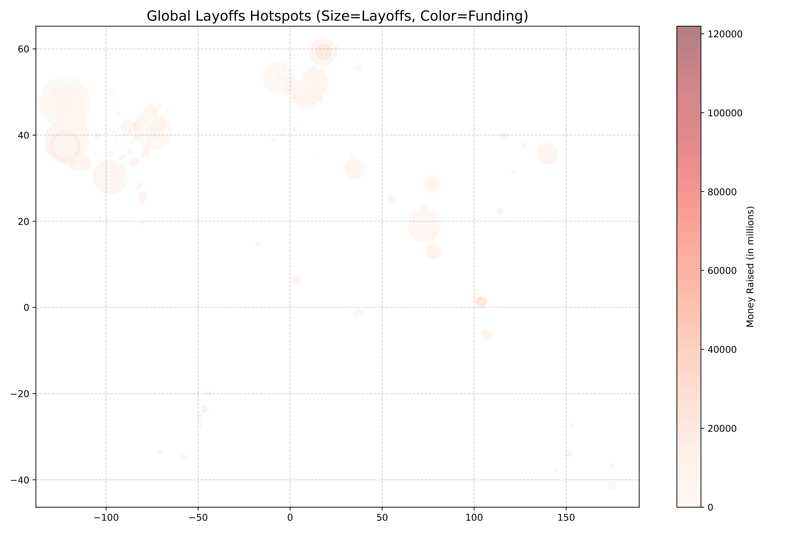
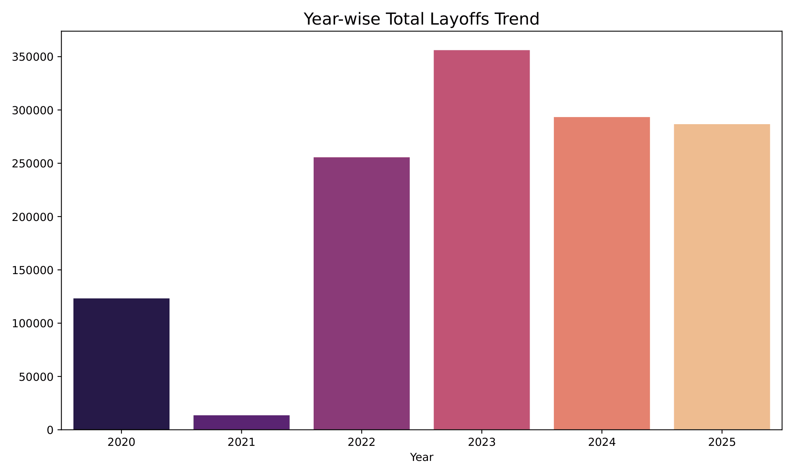
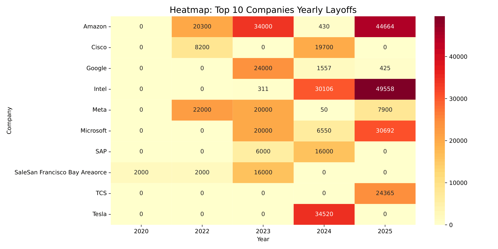
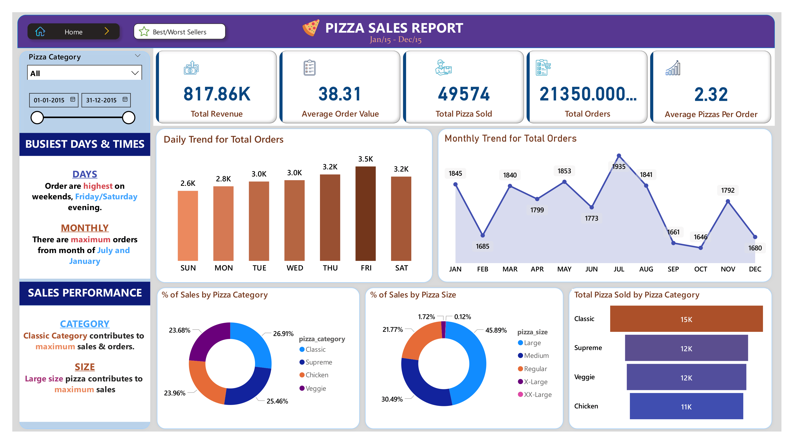
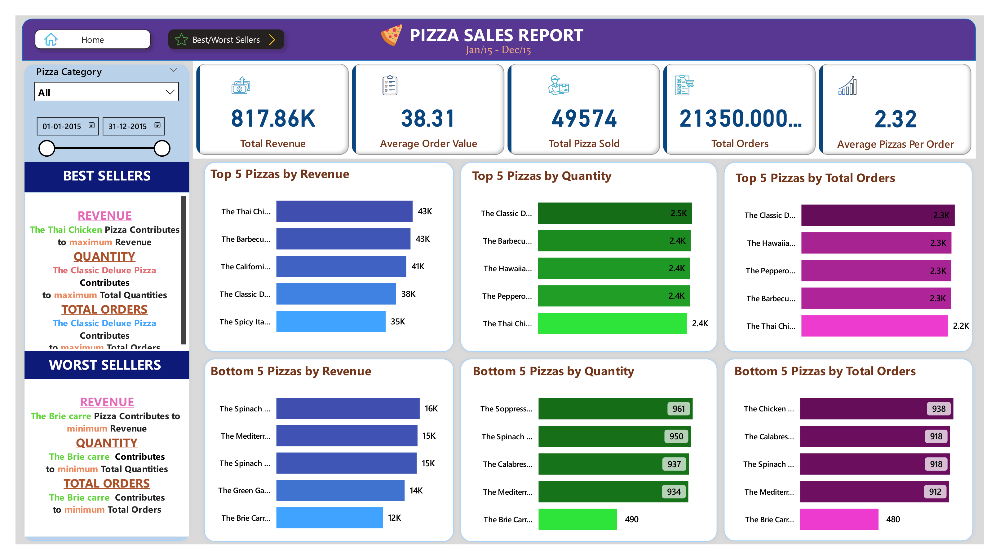

# Hi, I'm Shlok Anand! 👋
### 📊 Data Analytics & Visualization Portfolio

---

#### 🏏 IPL Data Analysis (2020-2025)
*Interactive Power BI Dashboard for IPL Auction & Player Performance.*

   
   
  

---

#### 📉 Tech Layoffs Data Analysis
*End-to-End Data Analysis of Tech Layoffs using Python, Pandas, and Seaborn.*

  
  
  
  
  
  
  

---

#### 🍕 Pizza Sales Dashboard
*Sales performance and customer trend analysis.*

  
  

---

---

### 📦 Amazon Sales Performance Dashboard
**Interactive Power BI Dashboard for E-commerce Sales & Logistics.**

* Analyzed over 20K rows of e-commerce data to structure a comprehensive performance dashboard mapping **₹11.58M** in total revenue.
* Streamlined operational visibility by tracking courier delivery statuses (85.6% shipped) and comparing fulfillment channels (Amazon vs. Merchant).
* [🔗 View Repository](https://github.com/shlok-45/Amazon-Sales-Dashboard)

### 🛠️ Tech Stack
- **Languages:** Python (Pandas, Seaborn, NumPy), SQL (MySQL)
- **Visualization:** Power BI, Tableau, Excel
- **Other Skills:** Machine Learning, Data Cleaning, SQL Optimization
